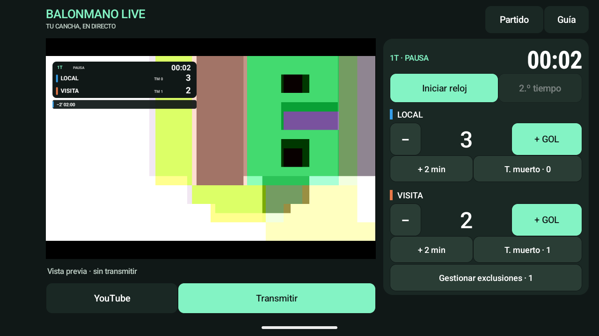
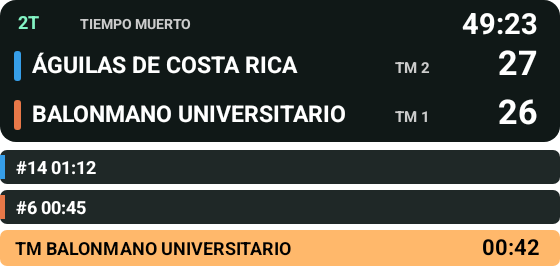

# Balonmano Live

Aplicación Android nativa en español para enviar cámara, audio y marcador a YouTube desde un teléfono. Android 8 (API 26) o posterior. Horizontal, 1280×720, H.264 a 30 fps/4 Mb/s, AAC mono a 128 kb/s y conexión RTMPS con verificación del certificado.

Gratuita, sin servidor propio, suscripciones, anuncios ni marca de agua añadida por la app.

## Instalar y usar

- [Descargar APK y versiones](https://github.com/SebKoreano/balonmano-live/releases).
- [Guía en español](docs/Guia-Balonmano-Live.md): instalación, configuración de YouTube y manejo durante el partido.
- [Pruebas realizadas y pendientes](docs/Verificacion.md).

**Estado: versión inicial en pruebas.** Se completaron 24 pruebas JVM y 3 pruebas Android en emulador. Está pendiente una transmisión privada de al menos 90 minutos desde un teléfono físico a YouTube, incluida la comprobación de audio, reconexión, batería y temperatura.

## Funciones

- Nombres y colores de equipos; goles con corrección y sin resultados negativos.
- Reloj acumulado con pausa, corrección y períodos ajustables; por defecto, dos tiempos de 30 minutos.
- Exclusiones simultáneas de dos minutos, dorsal opcional y corrección individual. Solo avanzan durante el juego y se conservan entre períodos.
- Tiempos muertos con contador por equipo y cuenta ajustable; prórrogas configurables.
- Marcador compuesto sobre la cámara antes de codificar: los controles del operador y la clave de transmisión no aparecen en el video.
- Recuperación del partido en pausa y reintentos de conexión.

La app registra las decisiones de la mesa; no impone límites reglamentarios de sanciones o tiempos muertos.

### Interfaz del operador



Captura de la app en un emulador Android; la cámara muestra una escena sintética de prueba.

### Marcador que recibe el público



## Proyecto

- `app/src/main/java/org/balonmano/live/domain`: estado inmutable, acciones y reloj monotónico. No depende de Android ni de internet.
- `data`: recuperación del partido con escrituras atómicas y credenciales cifradas con Android Keystore, excluidas de las copias de seguridad.
- `stream`: servicio de cámara/micrófono, reconexión y composición del marcador antes de codificar. La interfaz del operador nunca se usa como fuente de video.
- `ui`: controles nativos, configuración y renderizador público del marcador.

Las exclusiones consumen solo tiempo de juego, conservan su tiempo durante descansos y se editan de forma independiente. El reloj principal es acumulado. Un cierre recupera el último punto guardado en pausa, también durante un tiempo muerto. El guardado periódico limita a aproximadamente un segundo la pérdida de reloj en un cierre abrupto si el almacenamiento funciona normalmente. No hay reanudación automática de una transmisión tras reiniciar la app.

## Compilación

Herramientas: JDK 17, Android SDK Platform 37.0, Build Tools 36.0.0. El wrapper fija Gradle 9.6.1 y el proyecto usa Android Gradle Plugin 9.2.1 con Kotlin integrado. Dependencia de transmisión: RootEncoder 2.8.0, resuelta desde JitPack.

1. Instala JDK 17 y el SDK con Android Studio o las herramientas oficiales.
2. Define `JAVA_HOME` al JDK 17. Crea `local.properties` con `sdk.dir=C\:/ruta/al/Android/Sdk` (escapa los dos puntos).
3. Ejecuta en PowerShell:

```powershell
.\gradlew.bat testDebugUnitTest lintDebug assembleDebug
```

Para el APK de distribución, crea `signing.properties` (ignorado por Git) a partir de `signing.properties.example` y usa tu almacén de firma. Luego:

```powershell
.\gradlew.bat testDebugUnitTest lintRelease assembleRelease
```

Sin configuración de firma, `assembleRelease` produce un APK sin firmar. Nunca distribuyas un APK de depuración con claves reales: la versión release elimina las llamadas de registro de Android, incluidas las de la biblioteca de transmisión. Conserva el almacén y su contraseña para firmar todas las actualizaciones con la misma clave. Aumenta `versionCode` en cada actualización.

## Comprobaciones

Las pruebas JVM verifican reloj, pausas, períodos, exclusiones simultáneas, tiempos muertos, correcciones, prórrogas, recuperación y validación de la conexión. La simulación de 90 minutos comprueba el motor de tiempo; **no reemplaza** la prueba de transmisión de 90 minutos con un teléfono real.

Con un emulador o dispositivo de prueba conectado, `gradlew connectedDebugAndroidTest` verifica Android Keystore, el renderizador y un video MP4 local de 7 segundos a 720p con una pista AAC y una actualización de goles. No inicia ninguna conexión con YouTube. Esta prueba usa credenciales sintéticas y borra la conexión guardada: ejecútala solo sobre una instalación de prueba. La actividad de captura de prueba solo existe en la variante `debug`; no se incluye en la entrega `release`.

Se requiere prueba real de cámara, micrófono, permisos, interrupciones, cambios de red, legibilidad y temperatura antes del primer partido. Consulta la guía y el informe de verificación entregados con el APK.

## Colaborar

Puedes abrir un issue con el modelo del teléfono, versión de Android, pasos para reproducir el problema y comportamiento esperado. No publiques claves de YouTube, contraseñas ni almacenes de firma. Las propuestas de mejora y los pull requests son bienvenidos.

## Privacidad y distribución

Cada instalación es independiente. No hay servidor propio, analítica, anuncios ni cuentas de la app. Cámara, sonido y marcador se envían a YouTube únicamente cuando el operador confirma iniciar. Los datos del partido se guardan en el almacenamiento privado; la clave de YouTube se guarda cifrada en Android Keystore. El botón «Borrar conexión» elimina las credenciales guardadas. Desinstalar la app elimina sus datos locales. Compartir el APK no comparte los datos de tu canal.

La biblioteca RootEncoder se usa conforme a Apache-2.0; consulta `THIRD_PARTY_NOTICES.md`. La app propia se distribuye bajo licencia MIT, incluida en este proyecto.
